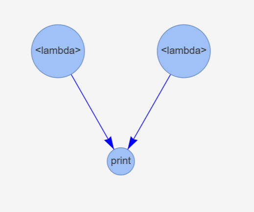

# Webber - "Parallel for Everyone"
A cross-platform Python library for building fast, no-latency workflows in embarassingly parallel.

Our goal is to enable Python code as orchestration, and make parallel computing accesible for everyone.

```python
import webber
from webber.xcoms import Promise

dag = webber.DAG()

fun_1: str = dag.add_node(lambda: "Hello")
fun_2: str = dag.add_node(lambda: "World!")
fun_3: str = dag.add_node(print, Promise(fun_1), Promise(fun_2))

dag.add_edge(fun_1, fun_3)
dag.add_edge(fun_2, fun_3)

dag.execute()
# 2024-06-12 21:53:42,233           print: Hello
# 2024-06-12 21:53:42,248           print: World!

dag.visualize()
```
### *The result, a simple visualization, served either as a Flask app or a static Matplotlib GUI.*




# Background
This project takes great inspiration from Pythonic orchestrators like Dagster and Airflow. Like Airflow, Webber's foundational concept is the [directed acyclic graph](https://en.wikipedia.org/wiki/Directed_acyclic_graph), or DAG, which is used to model and execute workflows as critical node paths. 

Most Python orchestrators are meant for working with large data processes at scale. So, for small-to-medium projects, they’re bulky and often generate multi-second latencies.

Webber is explicitly designed with edge computing and prototyping use-cases in mind. Unlike other projects, Webber enables real-time, optimized execution of Python functions, and improves on Apache Airflow’s execution latency from seconds to **milliseconds**.

At scale, this can be extremely useful for expediting data processes, and enables real-time, optimized execution of Python scripts for data wrangling and model training without convoluted code or expensive resources.

## When Should I Use Webber?

The overarching use case is: "*I have a Pythonic workflow that needs to be executed in parallel, and I cannot afford large overheads in storage or latency.*"

### *A high-level overview from our pitch document:*
### 

As such, the following applications are seen as best-fit:

**Python Code as Orchestration:** Workflows with inter-function dependencies that cannot be easily decoupled without databases/file-stores.

**Edge Computing:** Data retrieval and model training networks in low-overhead environments;

**Rapid Prototyping:** Experiment with structured multiprocessing in Python.

**It Needs to be Python:** My workflow is such that I can allow for sub-second latency between events, but not more. Although Webber is relatively low-cost in comparison to other parallelization frameworks in Python, it run *many magnitudes* slower than frameworks available in other high-level languages, such as Rust, C/C++, or Java.

## Features In Scope:

This project has seen some major improvements since its inception. In 2024, we've added support for the following features:

- **Conditional Edges:** DAGs can now continue execution along a node-path in case of a parent node's failure! Edge conditions are documented as in the enum `webber.Condition`, as `Success`, `Failure`, or `AnyCase`. Default edge condition is `Success`. See: `webber.Condition`

- **Retry Nodes:** Nodes can now be re-executed multiple times in case of failure. See: `DAG.retry_node(n)`

- **Skip Nodes:** DAGs can now skip over nodes and continue onto their child/dependent nodes. Before executing, skipped nodes can be pre-registered as either successful or failed executions, enabling diverse opportunities for DAG testing in tandem with conditional execution. See: `DAG.skip_node(n)`

- **Critical Node Paths:** Critical Node Paths: DAGs can be reduced to a set of specified nodes and their dependencies. Capability still under development. See: `DAG.critical_path(n)`

## Project Roadmap:
See our latest releases for an overview of what this module supports. Our next release(s) are expected to cover the following:

*Coming in Version 0.1.2:*
- Get/Update Functions for Nodes and Edges
- Introductory Jupyter notebooks and documentation
- Expanded support for Jupyter Notebook visualizations
- Edge and Node filtering with Lambda Functions (e.g.: `lambda e: e.Condition == condition.OnSuccess`).
