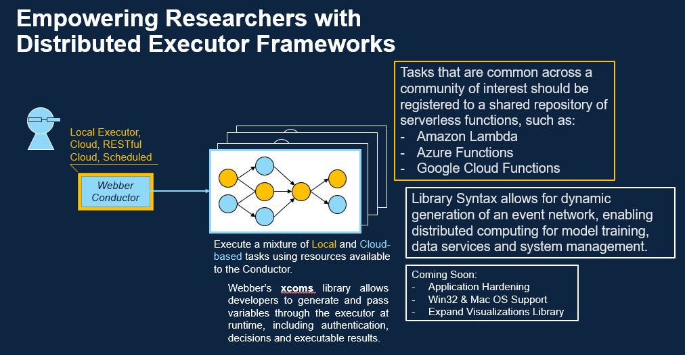

# Webber - "Parallel for Everyone"
A cross-platform Python library for building fast, no-latency workflows in embarrassingly parallel.

Our goal is to enable Python code as orchestration, and make parallel computing accessible for everyone.

```python
import webber
from webber import Promise

dag = webber.DAG()

hello = dag.add_node(lambda: "Hello")
world = dag.add_node(lambda: "World!")
printer = dag.add_node(print, Promise(hello), Promise(world))

dag.add_edge(hello, printer)
dag.add_edge(world, printer)

dag.execute()
# 2024-06-12 21:53:42,233           print: Hello
# 2024-06-12 21:53:42,248           print: World!

dag.visualize()
```
### *The result, a simple visualization, served either as a Flask app or a static Matplotlib GUI.*


# Background
This project takes great inspiration from Pythonic orchestrators like Dagster and Airflow. Like Airflow, Webber's foundational concept is the [directed acyclic graph](https://en.wikipedia.org/wiki/Directed_acyclic_graph), or DAG, which is used to model and execute workflows as critical node paths.

Most Python orchestrators are meant for working with large data processes at scale. So, for small-to-medium projects, they're bulky and often generate multi-second latencies.

Webber is explicitly designed with edge computing and prototyping use-cases in mind. Unlike other projects, Webber enables real-time, optimized execution of Python functions with **millisecond-scale overhead**.

At scale, this enables real-time, optimized execution of Python scripts for data wrangling and model training without convoluted code or expensive resources.

## Performance Benchmarks

| Scenario | Webber | Airflow | Prefect |
|----------|--------|---------|---------|
| DAG Setup | <1ms | ~500ms | ~100ms |
| 5 Parallel Nodes | <5ms | seconds | ~200ms |
| Task Coordination | milliseconds | seconds | ~100ms |

### QueueDAG Nesting Performance
When nesting QueueDAG inside a standard DAG (for iterative workflows):

| Iterations | Standalone | Nested | Overhead |
|------------|-----------|--------|----------|
| 10 | 1.3ms | 1.8ms | 1.3x |
| 50 | 1.0ms | 2.5ms | 2.5x |
| 100 | 1.0ms | 2.1ms | 2.1x |

*Fixed overhead of ~1-2ms per nested execution, well within real-time requirements.*

## Where Should I Start?

**You can install Webber and its dependencies from a Python environment like so:**
```
python -m pip install webber
```

**From there, we recommend referencing our [Examples directory](./examples/) for background readings, code examples, and introductory Jupyter Notebooks.**

**Up-to-date function-level documentation is available at [our PDocs site](https://webberteam.github.io/Webber/webber.html).**
- [webber.core documentation (DAG)](https://webberteam.github.io/Webber/webber/core.html)
- [webber.xcoms (Promise)](https://webberteam.github.io/Webber/webber/xcoms.html)
- [webber.edges (Condition, dotdict, edgedict)](https://webberteam.github.io/Webber/webber/edges.html)
- [webber.viz](https://webberteam.github.io/Webber/webber/viz.html) -- Internal visualization library, see: [`DAG.visualize()`](https://webberteam.github.io/Webber/webber/core.html#DAG.visualize)

## When Should I Use Webber?

The overarching use case is: "*I have a Pythonic workflow that needs to be executed in parallel, and I cannot afford large overheads in storage or latency.*"

### *A high-level overview from our pitch document:*
### 

As such, the following applications are seen as best-fit:

**Python Code as Orchestration:** Workflows with inter-function dependencies that cannot be easily decoupled without databases/file-stores.

**Edge Computing:** Data retrieval and model training networks in low-overhead environments;

**Rapid Prototyping:** Experiment with structured multiprocessing in Python.

**It Needs to be Python:** My workflow is such that I can allow for sub-second latency between events, but not more. Although Webber is significantly lower cost when compared to other parallelization frameworks in Python, it runs slower than frameworks available in other high-level languages, such as Rust, C/C++, or Java.

## Features In Scope:

This project has seen some major improvements since its inception. We've added support for the following features:

- **Conditional Edges:** DAGs can now continue execution along a node-path in case of a parent node's failure! Edge conditions are documented as in the enum `webber.Condition`, as `Success`, `Failure`, or `AnyCase`. Default edge condition is `Success`. See: `webber.Condition`

- **Retry Nodes:** Nodes can now be re-executed multiple times in case of failure. See: `DAG.retry_node(n)`

- **Skip Nodes:** DAGs can now skip over nodes and continue onto their child/dependent nodes. Before executing, skipped nodes can be pre-registered as either successful or failed executions, enabling diverse opportunities for DAG testing in tandem with conditional execution. See: `DAG.skip_node(n)`

- **Critical Node Paths:** Critical Node Paths: DAGs can be reduced to a set of specified nodes and their dependencies. Capability still under development. See: `DAG.critical_path(n)`

- **QueueDAG:** Iterative workflows where nodes execute repeatedly until a halt condition is met:
```python
import webber
qdag = webber.QueueDAG()

# Execute until return value >= 100, with safety limit
node = qdag.add_node(
    accumulator_func,
    halt_condition=lambda x: x >= 100,
    max_iter=1000
)
# Or simply iterate a fixed number of times
node = qdag.add_node(data_fetcher, iterator=50)
results = qdag.execute()  # Returns list of all outputs
```

## Project Roadmap:
#### See our latest releases for an overview of what this module supports. Our next release(s) are expected to cover the following:

#### *Added in Version 0.3:*
- **Comprehensive Test Suite**: 370 tests with 90% code coverage across all modules
- **Performance Benchmarks**: Improvement from sub-second to millisecond-scale latency
- **QueueDAG Overhaul:** Performance benchmarked and nesting supported.
- **Browser Visualization Improvements**: Browser visualization now works completely offline with bundled Vis.js assets. Modern dark theme UI with statistics panel, node/edge legend, and keyboard shortcuts.
- **New Code Examples + Documentation Overhaul**: Reorganized examples by feature, added performance tables, corrected QueueDAG latency claims
- Promise support documentation for QueueDAG (LIFO queue resolution)

#### *Added in Version 0.2:*
- **QueueDAG**: Support for DAGs where nodes are executed in parallel but node outputs are executed in sequence
- webber.Promises now support use of callables as keys
- Improved documentation and start-up guides
- Bug fixes for core DAG functions and simplified codebase

#### *Added in Version 0.1.2:*
- Get/Update Functions for Nodes and Edges
- Introductory Jupyter notebooks and documentation
- Expanded support for Jupyter Notebook visualizations
- Edge and Node filtering with Lambda Functions (e.g.: `lambda e: e.Condition == condition.OnSuccess`).

#### *Future Roadmap*:
You decide! We're taking recommendations for future work.
- Successor and predecessor functions
- Additional QueueDAG patterns and optimizations
